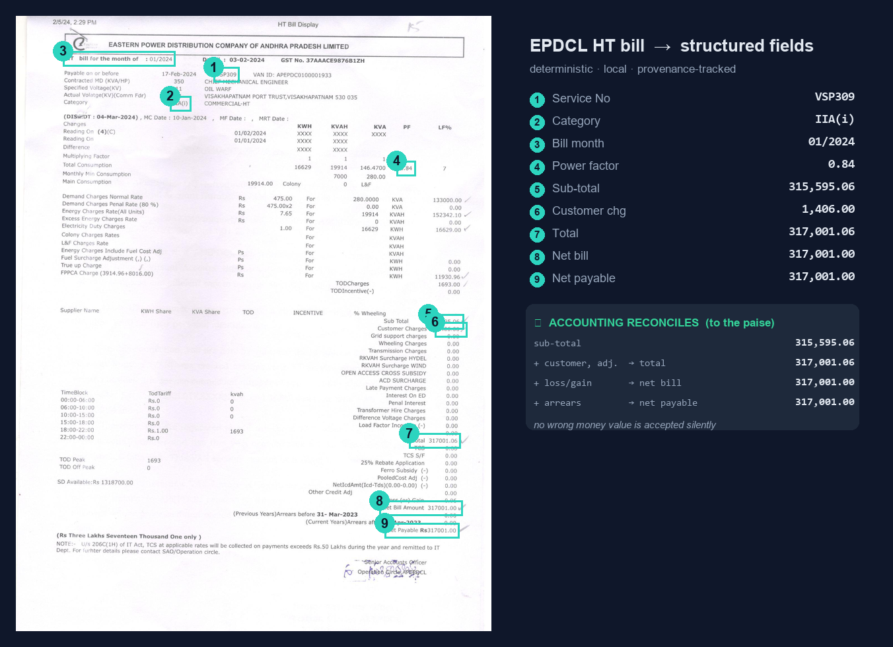
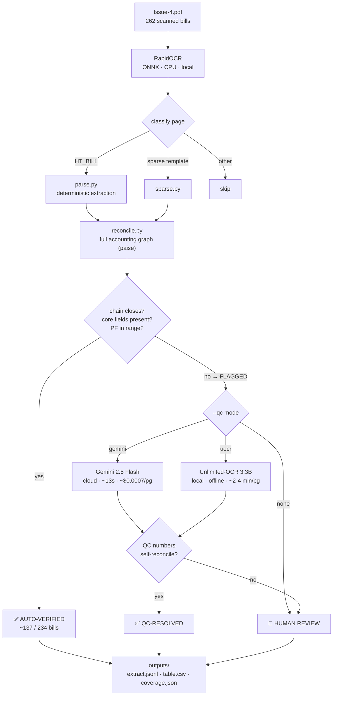

# OCR Lab — EPDCL HT Bill Extractor

Turn scanned **EPDCL HT electricity bills** (Issue-4.pdf, 262 pages) into accurate
text + structured, **provenance-tracked** fields — with a paise-level accounting
guardrail so **no wrong money value is ever accepted silently**.

The deterministic core is **100% local, offline, and CPU-only**. An optional
tier-2 re-reads only the pages that fail their own accounting, using either a
local VLM (offline) or a cloud VLM (fast) — always gated by the same guardrail.



---

## Highlights

- **Production, end-to-end.** One command turns a folder of scanned bills into
  structured, provenance-tracked fields **+ a ranked human-review queue**.
- **Self-healing.** Every bill is checked against its own arithmetic to the paise;
  a page that doesn't reconcile is automatically re-read by a vision model and, where
  the ledger allows, **auto-corrected** (e.g. a flipped arrears sign is recovered from
  `net_bill` & `net_payable`). Nothing wrong is accepted silently.
- **Autonomous.** Runs unattended; only the genuinely-unreadable residue reaches a person.
- **Local-first, cloud-optional.** 100% offline deterministic core; optional **Google
  Gemini** vision QC *only* when you allow it, *only* on the flagged pages.
- **Confidential mode.** A **fully-offline** path (local VLM QC) where no bill ever
  leaves the machine — nothing is sent to any cloud.
- **Featherweight core.** CPU-only, **no GPU**, ~270 MB RAM/worker, 15 MB models.
- **Minimal — and *safe* — HITL.** ~137/234 bills auto-verify with zero human touch;
  QC clears most of the rest, and the review gate is tuned so **0 wrong money values
  ever reach you unflagged** (flag-recall measured on held-out pages).

### Deployment modes — same guardrail, pick your trade-off

| mode | data leaves machine | footprint | speed | human queue |
|------|:---:|---|---|---|
| **Confidential** — deterministic + local VLM QC | **never** | heavier on flagged pages (~7–14 GB, VLM) | slow (~2–4 min/flagged pg) | small |
| **Fast** — deterministic + Gemini QC | flagged pages → Google | **low** (CPU-only) | fast (~13 s/flagged pg, ~$1/yr) | **~none** |
| **Pure local** — deterministic only | **never** | **low** (CPU-only) | fast | moderate |

> Honest note: *featherweight*, *near-zero-HITL*, and *fully-confidential* trade against
> each other on the **flagged ~40% minority** — the clean majority is fast, local, and
> hands-free in every mode.

---

## The pipeline at a glance



**Three tiers, one guardrail:**

| tier | what | volume (typical batch) | cost |
|------|------|------------------------|------|
| **1. Deterministic** (local, offline, auditable) | RapidOCR → `parse` → `reconcile` | ~137 / 234 auto-verified to the paise | free |
| **2. VLM QC** (flagged pages only) | Gemini *or* Unlimited-OCR re-reads | ~107 flagged → most resolved | ~$0.08 (gemini) / $0 (uocr) |
| **3. Human** | the residue neither tier can close | a handful | — |

The guardrail (`reconcile`) has the final say on every rupee: a QC read is
**accepted only if its own numbers satisfy the bill's accounting identities**.
A hallucinated or misread value cannot close the ledger, so it is routed to a
human instead — the AI proposes, the accounting decides.

---

## Quick start

```bash
cd ocr_lab
pip install rapidocr-onnxruntime pypdf pillow numpy opencv-python-headless

# deterministic only — fast, 100% local, offline
python run_full.py

# + cloud QC on flagged pages (needs GEMINI_API_KEY)
python run_full.py --qc gemini

# + local VLM QC on flagged pages (offline; installs torch + Unlimited-OCR on first run)
python run_full.py --qc uocr

python -m pytest test_accounting.py -q     # 17 accounting tests
python eval.py                             # field-exact score vs frozen vision GT
```

Outputs land in `ocr_lab/outputs/`:
- **`extract.jsonl`** — one row per page: fields with provenance, reconcile result, QC read.
- **`table.csv`** — flat key fields per bill (+ `qc_resolved`).
- **`coverage.json`** — classification counts, reconcile rate, QC resolution rate.

---

## Results

- **Field-exact vs frozen vision ground truth:** ~98% (dev 98.0%; held-out batches 97.6% / 98.4%).
- **Production safety:** flag-recall 89%, **0 silent money errors** — every wrong money value lands on a flagged page.
- **Full 262 with Gemini QC:** 105 / 107 flagged pages resolved; after the 3-identity guardrail, the human queue for that batch went to **0** (2 were Gemini sign/digit slips the accounting recovered).
- **Gemini cost:** $0.00074/page → ~$0.08 per monthly batch → **~$1/year**.

### Local VLM bake-off (reading our hardest money fields)

| model | size | accuracy | speed (CPU) | offline |
|-------|------|----------|-------------|---------|
| SmolVLM-256M | 0.26B | 3/8 (drops digits) | fast | ✅ |
| Qwen2-VL-2B | 2B | 6/8 (perfect digits, drops signs) | ~40 s/pg | ✅ |
| **Unlimited-OCR** | 3.3B | flawless on clean bills; blanks faint/credit lower panels | ~2–4 min/pg | ✅ |
| Gemini 2.5 Flash | cloud | 9/9 | ~13 s/pg | ❌ |

---

## System requirements

**Minimum (tier 1, deterministic):** 4 GB RAM · any 64-bit CPU · **no GPU** · ~1 GB disk.
A 262-page batch takes ~90 min serial (~20 min parallel). Peak ~270 MB/OCR worker; the OCR models are 15 MB.

**Tier 2 local (`--qc uocr`):** +~7–14 GB RAM, ~2–4 min/flagged page on CPU. An Intel Arc iGPU (OpenVINO) is the real speed lever — deferred.

**Tier 2 cloud (`--qc gemini`):** ~0 local resources; needs internet + a free Gemini API key.

---

## Where things live

All code is in **[`ocr_lab/`](ocr_lab/)**. Start with:
- **[`ocr_lab/README.md`](ocr_lab/README.md)** — module readme + full repository map.
- **[`ocr_lab/HANDOVER.md`](ocr_lab/HANDOVER.md)** — design rationale, bake-off findings, limitations, how to run a monthly batch.

Key modules: `common.py` (OCR), `parse.py` (extraction), `reconcile.py` (accounting graph),
`run_full.py` (runner + `--qc` switch), `qc_gemini.py` / `uocr.py` (the two QC backends),
`eval.py` + `test_accounting.py` (scoring + tests).
