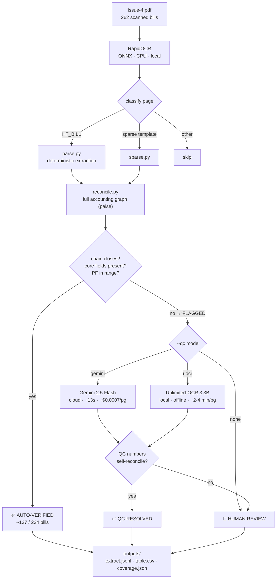

# OCR Lab — EPDCL HT Bill Extractor

Turn scanned **EPDCL HT electricity bills** (Issue-4.pdf, 262 pages) into accurate
text + structured, **provenance-tracked** fields — with a paise-level accounting
guardrail so **no wrong money value is ever accepted silently**.

The deterministic core is **100% local, offline, and CPU-only**. An optional
tier-2 re-reads only the pages that fail their own accounting, using either a
local VLM (offline) or a cloud VLM (fast) — always gated by the same guardrail.

---

## The pipeline at a glance



**Three tiers, one guardrail:**

| tier | what | volume (typical batch) | cost |
|------|------|------------------------|------|
| **1. Deterministic** (local, offline, auditable) | RapidOCR → `parse` → `reconcile` | ~137 / 234 auto-verified to the paise | free |
| **2. VLM QC** (flagged pages only) | Gemini *or* Unlimited-OCR re-reads | ~107 flagged → most resolved | ~$0.08 (gemini) / $0 (uocr) |
| **3. Human** | the residue neither tier can close | a handful | — |

The guardrail (`reconcile`) has the final say on every rupee: a QC read is
**accepted only if its own numbers satisfy the bill's accounting identities**.
A hallucinated or misread value cannot close the ledger, so it is routed to a
human instead — the AI proposes, the accounting decides.

---

## Quick start

```bash
pip install rapidocr-onnxruntime pypdf pillow numpy opencv-python-headless

# deterministic only — fast, 100% local, offline
python run_full.py

# + cloud QC on flagged pages (needs GEMINI_API_KEY)
python run_full.py --qc gemini

# + local VLM QC on flagged pages (offline; installs torch + Unlimited-OCR on first run)
python run_full.py --qc uocr

python -m pytest test_accounting.py -q     # 17 accounting tests
python eval.py                             # field-exact score vs frozen vision GT
```

Outputs land in `outputs/`:
- **`extract.jsonl`** — one row per page: fields with provenance, reconcile result, QC read.
- **`table.csv`** — flat key fields per bill (+ `qc_resolved`).
- **`coverage.json`** — classification counts, reconcile rate, QC resolution rate.

---

## Results

- **Field-exact vs frozen vision ground truth:** ~98% (dev 98.0%; held-out batches 97.6% / 98.4%).
- **Production safety:** flag-recall 89%, **0 silent money errors** — every wrong money value lands on a flagged page.
- **Full 262 with Gemini QC:** 105 / 107 flagged pages resolved; after the 3-identity guardrail, the human queue for that batch went to **0** (2 were Gemini sign/digit slips the accounting recovered).
- **Gemini cost:** $0.00074/page → ~$0.08 per monthly batch → **~$1/year**.

### Local VLM bake-off (reading our hardest money fields)

| model | size | accuracy | speed (CPU) | offline |
|-------|------|----------|-------------|---------|
| SmolVLM-256M | 0.26B | 3/8 (drops digits) | fast | ✅ |
| Qwen2-VL-2B | 2B | 6/8 (perfect digits, drops signs) | ~40 s/pg | ✅ |
| **Unlimited-OCR** | 3.3B | flawless on clean bills; blanks faint/credit lower panels | ~2–4 min/pg | ✅ |
| Gemini 2.5 Flash | cloud | 9/9 | ~13 s/pg | ❌ |

---

## System requirements

**Minimum (tier 1, deterministic):** 4 GB RAM · any 64-bit CPU · **no GPU** · ~1 GB disk.
A 262-page batch takes ~90 min serial (~20 min parallel). Peak ~270 MB/OCR worker; the OCR models are 15 MB.

**Tier 2 local (`--qc uocr`):** +~7–14 GB RAM, ~2–4 min/flagged page on CPU. An Intel Arc iGPU (OpenVINO) is the real speed lever — deferred.

**Tier 2 cloud (`--qc gemini`):** ~0 local resources; needs internet + a free Gemini API key.

---

## Repository map

| file | role |
|------|------|
| `common.py` | RapidOCR (ONNX) OCR + page rendering + document classification |
| `parse.py` | deterministic field extraction (shear-align, money-column, fuzzy labels) |
| `reconcile.py` | full accounting graph + precise review-triage gate |
| `sparse.py` | alternate parser for the sparse bill template |
| `tess_check.py` | gated Tesseract cross-check for FPPCA misreads |
| `qc_gemini.py` | tier-2 Gemini backend + the accounting self-consistency guardrail |
| `uocr.py` | tier-2 Unlimited-OCR (local, offline) backend |
| `run_full.py` | production runner with the `--qc uocr\|gemini` switch |
| `qc_run.py` | standalone Gemini tier-2 runner + token-cost report |
| `eval.py` | field-exact scoring vs frozen vision GT (provenance-checked) |
| `holdout_test.py`, `bigger_exam.py`, `next_batch.py` | held-out GT batches (overfit guard) |
| `flag_recall.py` | production-safety metric (flag-recall, silent-money-error count) |
| `test_accounting.py` | pytest suite (17 tests) |
| `render.py`, `preprocess.py`, `parallel_ocr.py` | rendering, deskew/upscale (tested), multiprocessing OCR |
| `best/` | frozen champion snapshot |
| `samples/gt/` | **immutable** frozen vision ground truth (9 pages) |

See **[HANDOVER.md](HANDOVER.md)** for design rationale, the full bake-off findings, known limitations, and how to run a monthly batch.
